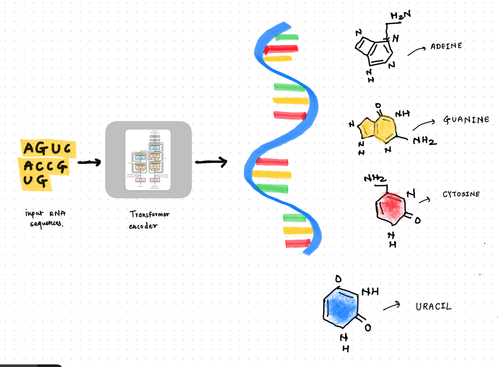

# RNATransFormer
Code of RNA transformer model. This Transformer model can be used to prdict RNA 3D structure if you have an RNA sequence. Model gives output as 3D point x,y,z for each neucliotide from the RNA sequence given to the model.

---
### 1. What is different in this model architecture compared to generic transformer architecture.
The goal of studying this model architecture is to understand the way we can model RNA sequences using transformer architecture. We are already familiar with modeling the English language using transformer encoder but this is something curious to explore. the RNA sequence modeling using transfomer encoder. Unlike generic transformer architecture described in "Attention is All You Need" paper this RNAModel has following major differences which helps to model RNA sequences using trasnformer.

#### 1.1 Outer Product Mean
- Outer product mean helps to learn the pairwise relationships between elements from the RNA sequence.
- It highlights the complementarity and dependency relationships between neucleiotide.
- It also do expansion and compression of the features space to understand the complex patterns.
  
#### 1.2 Triangular multiplicative module
- This module helps to enrich pairwise representations by incorporating triangular relationships between neucleiotides.
- It helps to understand the non-local interactions.

  This two techniques described well in blog post here. ([Link](https://jaydevtonde.substack.com/p/rna-transformer))
---

### 2. Model Weights intialization.
#### Initially before training the model on RNA data. Weights initialization will work as following
1. Linear Layer's : PyTorch uses a method called Kaiming uniform initialization by default
2. Embeddings     : For the nn.Embedding layer, PyTorch initializes the weights from a uniform distribution.
3. LayerNorm : nn.LayerNorm layers initialize their weights to 1 and biases to 0 by default.
---

### 3. Key changes in the original model architecture.
#### 3.1 Model decoder layer :
- Original RibonanzaNet has decoder output dimensions as 2 cause it was used to predict the reactivity of the neucleiotides.
- Updating it to 3 cause we are training the model for 3D RNA structure predicition. Our new model will output 3 logits for x,y,z respectively for 3D dimensions.

#### 3.2 Outer Product Mean module :
- Original outer product mean module was implemented using einstein equation of matrix multiplication.
- We have updated it to do the same using simple metric multiplications.
---
### 4. Dataset used : 
For first experiment I used the training data of kaggle competition itself here is the ([Link](https://www.kaggle.com/competitions/stanford-rna-3d-folding)).
For second experiment I used 10,000 samples from publically available dataset of 4 lakh RNA sequences. It took around 24 hrs. to train the model on this 10000 samples.

---

### 5. Hardware used for model training.

| Specification       | Value                        |
|---------------------|-----------------------------|
| **GPU Model**       | Quadro RTX 8000             |
| **CUDA Version**    | 12.2                        |
| **GPU Memory**      | 49152 MiB (48 GB)           |

---

### 6. Model experiments and evaluation scores.
| Experiment Name     | No. of samples in training  | LB score(TM-Score) |
|---------------------|-----------------------------|----------|
|  Experiment 1       | 844                         | 0.161    |
|  Experiment 2       | 10000                       | 0.279    |

### 7. References
1. https://github.com/Shujun-He/RibonanzaNet.
2. https://www.kaggle.com/competitions/stanford-rna-3d-folding.
